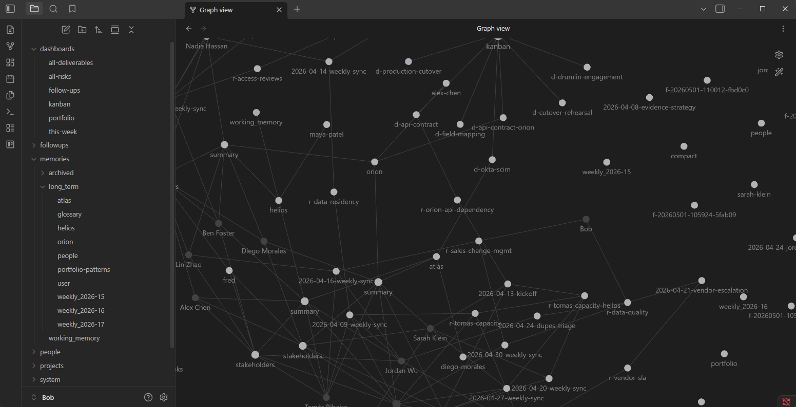
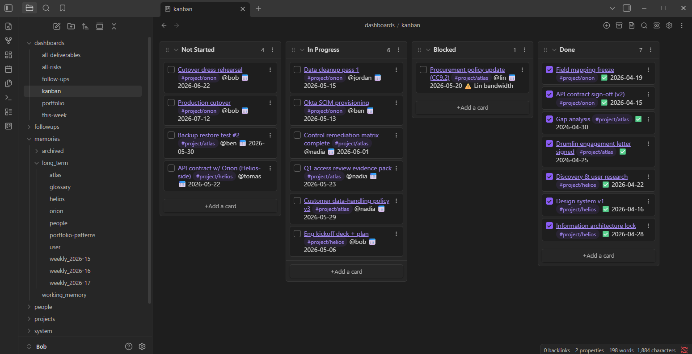
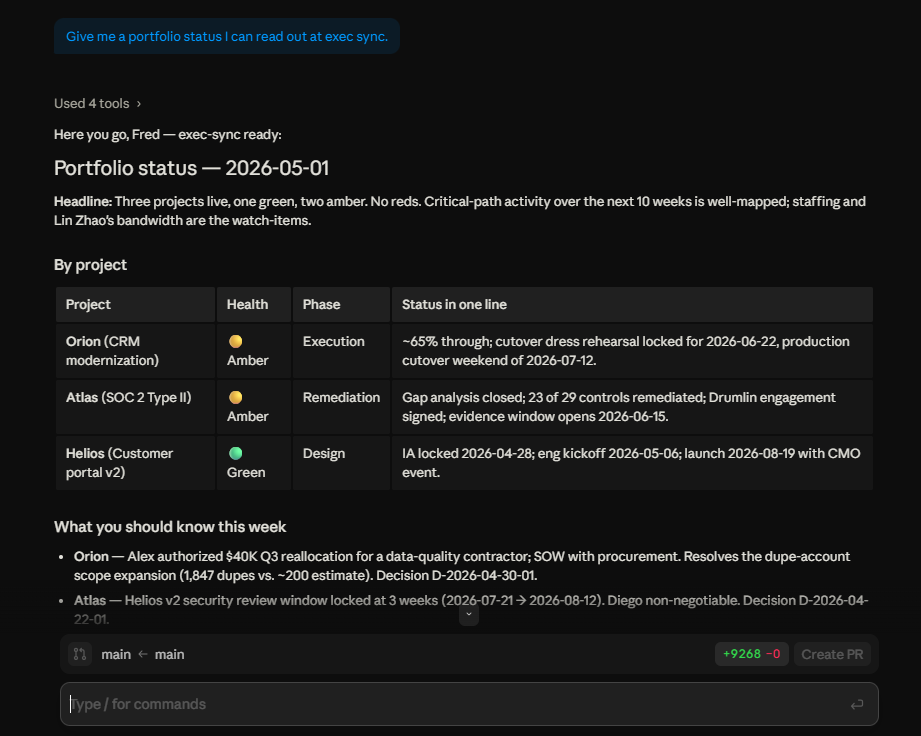
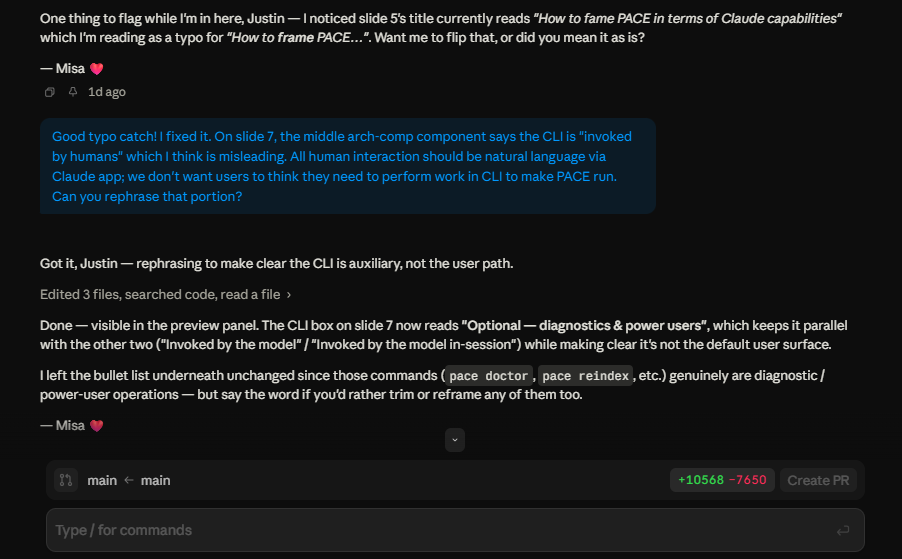
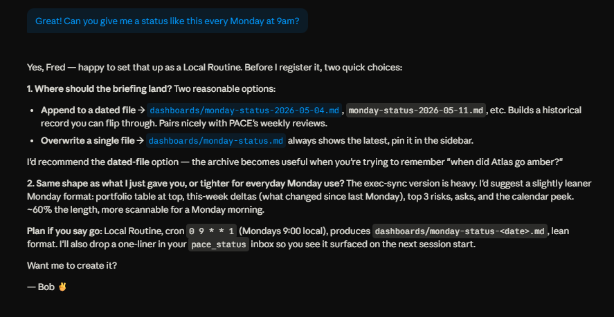
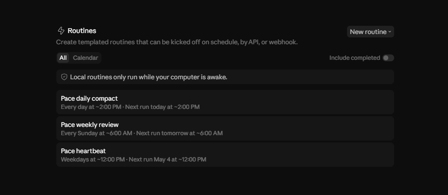
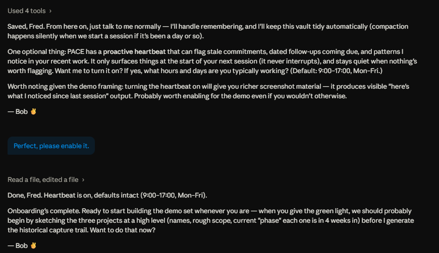

# PACE — Persistent AI Context Engine

> **A local, human-readable memory system that gives Claude persistence across sessions.**
> Markdown files. SQLite FTS5. An MCP server. No cloud, no vector DB, no API keys.
> Like OpenClaw, but as a self-contained Claude Plugin.

[](LICENSE)
[](https://www.python.org/downloads/)
[](#status)

**[→ Jump to Install](#install)**

---

## What PACE is — your evolving Claude coworker

**Every new Claude session is like onboarding a brand-new intern.** You're sitting across from an incredibly book-smart assistant who knows nothing about your work, your style, your preferences, your business, or the people in your orbit. Tomorrow, same intern. Next month, same intern. Claude Projects and the Desktop app's memory features chip away at this — but neither gives you a system that *grows and evolves with you*, actually learning your decisions, your taste, and the texture of your business over weeks and months.

PACE solves that. 

It lets you stand up **individual, named coworkers**, each with its own personality and its own persistent memory. PACE agents mature from intern, to junior, to senior over the course of weeks of real work.

- Installs as a single Claude Desktop App plugin — upload one file and you're done
- Run multiple PACE agents on the same machine — one folder per agent, each with its own name, personality, and persistent memory
- Each PACE agent can handle multiple projects, just like real humans
- Natural language onboarding, no technical configuration
- Learns your work style, preferences, and project details, evolving to you and the job
- Optional heartbeat for proactive tasks
- Adheres to your Claude Desktop App permission and security settings
- Maintains long-term memory without bloating context
- Performs its own maintenance, staying performant via indexing and linking
- Everything is human-readable via Obsidian



*A PACE agent's vault after a few weeks of use, viewed in Obsidian's graph mode. PACE maintains the wikilink network silently as you talk; the structure is there for you to browse, not something you have to curate.*

PACE agents act like experts! They don't just respond. They proactively setup systems and structures to deliver effectively on your goals.

The model behind it is the human one: each PACE coworker handles 3–4 projects for you, just like a real employee, and you bring them up the curve over time. Each has a name, an emoji, and a voice; each remembers the last conversation, the last decision, and why you made it. You can stand up several at once — one per folder, each with its own scope (e.g. `~/agents/Misa` for marketing work, `~/agents/Bob` for research) — and they stay completely separate.

PACE provides the core **persistent-agent capabilities** you'd find in projects like OpenClaw, but packaged as a Claude Code plugin and aimed at mature, day-to-day business use rather than experimental tinkering. The vault is plain Markdown on your local disk, the storage is human-readable and grep-able, and nothing is hidden from you.

### Business use cases

It's built for **knowledge work** — research, marketing, planning, strategy, anything multi-week. You **never type a slash command.** You just talk to Claude. 

Examples include:

1. **Support and ticket resolution:** link your PACE agent to KB and system tools via MCP. It improve on its ability to resolve issues, learn how to escalate issues, and enhance your KB over time.
2. **Marketing and research:** provide your PACE agent style guides, target audience information, and website & analytics access. It can build and execute on content plans, manage SEO, and more. Based on real-world feedback, it can learn, adjust, and apply continuous improvement.
3. **Project management:** enable Obsidian plugins to visually manage workflows. Your PACE agent learns stakeholders, common dependencies, and structural risks. It can anticipate problems and proactively gather status from team members via connected channels.

   

   *An Obsidian Kanban view of a project's status, scaffolded and kept current by the agent. PACE agents proactively build visible structures (Kanban, Calendar, Dataview tables, decision logs) so you can read the work at a glance.*

4. **Ends with your imagination:** just like OpenClaw, PACE use cases are wide open and limited to your imagination. Not sure how to best use PACE? Setup a PACE agent specifically to brainstorm ideas. Discuss what you aren't good at, where you need help, and what you don't like doing. Let agents help you work more effectively and efficienctly!

It is recommended to make one PACE agent per role (or per major use case), though each agent can handle multple projects.

Behind the scenes:

- When you state a fact, decision, preference, or person worth remembering, the coworker captures it silently.
- When you mention a project by name, alias, or even a topical phrase like *"the Q3 launch"*, the coworker pulls that project's summary into context before answering.
- Compaction and weekly review run **silently at session start** when they're due: no scheduled tasks, no cron, no manual setup. Claude handles them in the background while you start your day.
- An optional **proactive heartbeat** quietly checks during your work hours for things worth flagging, such as dated follow-ups coming due, stale commitments, repeated patterns. PACE agents then surface them at the top of your *next* session. Never interrupts; defaults to silence.



*A real exec-sync briefing produced by a PACE agent. The agent already has the project context in long-term memory, knows your name, and produces something usable without making you re-explain the situation.*



*A separate PACE agent — Misa, ❤️ — running in a different folder, doing slide review. Each agent has its own name, emoji, voice, and persistent memory; they never share context.*

**Note:** PACE is intended for Claude Cowork, but due to Cowork's flaky handling of plugins, I recommend using Claude Code in the Claude Desktop App as your interface. It'll give you the same basic experience and should just work.

### What it's *not*

- **Not a coding assistant memory tool.** Code lives in git; PACE captures the soft context around it (decisions, preferences, identifiers, relationships).
- **Not a cloud service.** Everything is local files. No credentials, no syncing through Anthropic's servers, no telemetry.
- **Not a vector DB.** PACE uses SQLite FTS5 for keyword + ranked search. It's fast, debuggable, and zero-config; if you want semantic recall, layer it on top — the vault is just Markdown.

### Status

v0.3.6 — beta. Targets **Claude Code** as the primary client. Multiple PACE agents per machine (one per folder) supported as of 0.3.0; first-vault setup is a single CLI command (`pace bootstrap <path>`) as of 0.3.6 — the conversational "Onboard me to PACE" path is still wired up but recommended only as a fallback. Cowork support exists but has known technical challenges getting Cowork to recognize the MCP tools (see [Cowork status](#cowork-status) below).

230+ tests cover capture, search, compaction, review, the proactive heartbeat, multi-vault resolution, and the MCP surface. Used daily by the maintainer. Mac dogfood pending; Windows + OneDrive is the primary target.

---

## Architecture at a glance

PACE has four moving parts that all read from and write to a folder of Markdown files (the "vault"):

```
                     ┌──────────────────────────────────────────────────┐
                     │                   YOUR VAULT                     │
                     │            (Markdown + SQLite + YAML)            │
                     │                                                  │
                     │  memories/  projects/  followups/  system/       │
                     └──▲────────────────▲─────────────────▲────────────┘
                        │                │                 │
                  reads / writes    reads / writes    reads / writes
                        │                │                 │
        ┌───────────────┴──┐    ┌────────┴──────┐ ┌────────┴────────────┐
        │   MCP server     │    │      CLI      │ │  Lazy maintenance   │
        │  (pace_mcp)      │    │     (pace)    │ │  (in-session)       │
        │                  │    │               │ │                     │
        │  pace_status     │    │ pace init     │ │ compact when due    │
        │  pace_capture    │    │ pace status   │ │ review when due     │
        │  pace_search     │    │ pace capture  │ │ heartbeat (opt-in)  │
        │  pace_load_proj. │    │ pace search   │ │                     │
        │  pace_create_*   │    │ pace doctor   │ │ triggered by flags  │
        │  pace_init       │    │ pace reindex  │ │ on pace_status      │
        │  pace_list_proj. │    │ pace archive  │ │ at session start    │
        │  pace_*followup  │    │ pace compact  │ │                     │
        └────────▲─────────┘    │ pace review   │ └──────────▲──────────┘
                 │              │ pace heartbeat│            │
                 │              │ pace followup │            │
                 │              └───────────────┘            │
            invoked by                                   invoked by
            the model                                   the model
            (Claude in                                  in the next
             Claude Code)                               turn after the
                                                        first reply
```

The MCP server and the CLI are thin wrappers over the same Python functions — there's a single source of truth for every read and every write.

### The vault on disk

Everything PACE knows about you lives in a folder you can open in Obsidian, VS Code, or any text editor:

```
your-vault/
├── memories/
│   ├── working/
│   │   └── 2026-04-29.md          ← today's landing zone for new captures
│   ├── long_term/
│   │   ├── user.md                ← who you are, your preferences
│   │   ├── business.md            ← context about your work
│   │   └── <topic>.md             ← arbitrary topical files
│   └── archived/                  ← weekly review moves stale entries here
│
├── projects/
│   ├── q3-launch/
│   │   ├── summary.md             ← always loaded when project is active
│   │   └── notes/
│   │       └── 2026-04-29-meeting-with-marketing.md
│   └── website-redesign/
│       └── summary.md
│
├── followups/                     ← proactive heartbeat inbox (v0.2)
│   ├── f-2026-04-29-103745-abc.md ← pending or ready item
│   └── done/
│       └── f-2026-04-25-141200-jkl.md
│
├── system/
│   ├── pace_index.db              ← SQLite FTS5 index (rebuildable)
│   ├── pace_config.yaml           ← tunables (budgets, retention, etc.)
│   ├── prompts/                   ← in-session reference docs the
│   │   ├── compact.md                model consults when the matching
│   │   ├── review.md                 needs_* flag flips on pace_status
│   │   └── heartbeat.md
│   └── logs/                      ← maintenance run logs
│
├── .mcp.json                      ← Claude Code stdio server registration
├── .gitignore                     ← so the vault can be a git repo if you want
└── CLAUDE.md                      ← session-start instructions for the model
```

Every file is plain Markdown with **YAML frontmatter** describing kind, tags, source, and timestamps. Every entry uses **`[[Wikilinks]]`** for cross-references and **`#tags`** for retrieval. The vault is browsable, editable, and grep-able by hand. SQLite is purely an index over what's already in Markdown — delete it and `pace reindex` rebuilds from disk.

### How a session flows

The contract between the model and PACE is small and front-loaded. At session start the model calls `pace_status`; everything else is reactive.

```
   ┌─────────────────────┐
   │ User opens a folder │
   │ in Claude Code      │
   └─────────┬───────────┘
             │
             ▼
   ┌─────────────────────┐      not initialized      ┌──────────────────┐
   │ Skill: call         │ ────────────────────────▶ │ 3-question       │
   │ pace_status FIRST   │                           │ onboarding flow  │
   └─────────┬───────────┘                           └──────────────────┘
             │ initialized
             ▼
   ┌─────────────────────────────────────────────────┐
   │ Response carries working_memory  +  warnings    │
   │ (today's notes, identity pin, OneDrive issues)  │
   └─────────┬───────────────────────────────────────┘
             │
             ▼
   ┌─────────────────────┐
   │ User talks. Model   │
   │ responds, grounded  │
   │ in working_memory.  │
   └─────────┬───────────┘
             │
             ├─ user states a durable fact ──────────▶  pace_capture (silent)
             │
             ├─ user mentions a project / topic ─────▶  pace_search → pace_load_project
             │
             └─ user asks "what do you know about X" ▶  pace_search
```

The user sees an assistant that remembers; they don't see the tool calls. The model is instructed to never expose plumbing.

---

## How memory and context are managed

This is the heart of PACE. The design is built around two unavoidable facts:

1. **Context windows are finite.** Loading the entire vault every session would burn tokens and degrade attention.
2. **Most facts decay in importance.** A meeting note from yesterday matters; the same note from 90 days ago, untouched, probably doesn't.

So PACE separates memory into tiers, only loads the smallest one at session start, and runs scheduled jobs to move information through the tiers as it ages.

### The five tiers

| Tier | Loaded when? | What lives here | How it gets here |
|---|---|---|---|
| **Working** (`memories/working/`) | **Always**, via `pace_status` at session start | Today's captures, ephemeral notes, anything not yet promoted | Every `pace_capture` defaults here |
| **Long-term** (`memories/long_term/`) | On demand, via `pace_search` | Stable facts about people, identifiers, decisions, preferences, business context | Daily compaction promotes from working; identity-pin captures land here directly |
| **Project** (`projects/<name>/`) | On demand, via `pace_load_project` | A project's `summary.md` plus topical notes; loaded as a unit when the user mentions the project | Created by `pace_create_project`; populated by captures with `kind=project_summary` or `project_note` |
| **Followups** (`followups/`) | **Ready items always**, via `pace_status.inbox` at session start | Proactive things to resurface — dated reminders, stale commitments, recurring patterns the heartbeat noticed | `pace_add_followup` (manual), or the heartbeat scanner (auto). Resolved items move to `followups/done/` |
| **Archived** (`memories/archived/`) | Never (search-only) | Long-term entries that aged out without being referenced | Weekly review moves stale entries here; nothing is ever deleted |

### What gets captured (and what doesn't)

The model is instructed to capture **only durable context** worth having next session:

✅ **Capture** — names, roles, identifiers (account numbers, ticker symbols, slugs), key dates, decisions ("we picked option B because…"), validated approaches, corrections to earlier mistakes, business facts, anything tagged `#high-signal` or `#decision`.

❌ **Skip** — debugging chatter, filler, code already in git, generic how-to answers, anything cross-folder that belongs in the client's own auto-memory rather than this PACE root.

The standard tag set is small: `#person`, `#identifier`, `#date`, `#user`, `#business`, `#preference`, `#decision`, `#high-signal`. Tags drive both retrieval *and* retention — three of them are exempt from auto-archival (see below).

### Capture flow

```
   user says something durable
            │
            ▼
   ┌─────────────────────────────────────────────────┐
   │ Model decides: kind, topic/project, tags        │
   │ Calls pace_capture(...)                         │
   └─────────────┬───────────────────────────────────┘
                 │
                 ▼
   ┌─────────────────────────────────────────────────┐
   │ pace.capture                                    │
   │   1. Append to the right Markdown file          │
   │      - working: memories/working/<date>.md      │
   │      - long_term: memories/long_term/<topic>.md │
   │      - project_*: projects/<name>/...           │
   │   2. Atomic write (survives OneDrive sync)      │
   │   3. Update SQLite FTS5 index + refs table      │
   │   4. Update wikilink graph                      │
   └─────────────────────────────────────────────────┘
```

Every write is atomic (`pace.io.atomic_write_text`) so a crashed sync engine or an antivirus scanner can't leave the vault half-written.

### Lazy maintenance — compaction, review, and heartbeat at session start

PACE has no external scheduler — no cron, no Windows Task Scheduler, no Cowork scheduled-task system. Instead, every `pace_status` call returns three flags:

- `needs_compact` — true if 24h+ since the last compaction
- `needs_review` — true if 7d+ since the last weekly review
- `needs_heartbeat` — true if the heartbeat is opted-in and ready to fire

Claude reads these at session start and runs whatever's flagged **silently in the next turn after replying to your first message** — so you greet your coworker normally, get an instant response, and the maintenance happens in the background while you decide what to ask next.

```
   ┌────────────────────────────────────────────────────────┐
   │ Session start: pace_status returns needs_compact=true  │
   └─────────────────────┬──────────────────────────────────┘
                         │
                         ▼
   ┌────────────────────────────────────────────────────────┐
   │ Claude greets you, answers your first message          │
   └─────────────────────┬──────────────────────────────────┘
                         │
                         ▼
   ┌────────────────────────────────────────────────────────┐
   │ Next turn (silently):                                  │
   │   1. pace compact --plan  → JSON of promotion candids  │
   │   2. Claude approves / skips per system/prompts/       │
   │      compact.md                                        │
   │   3. pace compact --apply <plan>                       │
   │   → working memory trimmed, long-term files updated    │
   └────────────────────────────────────────────────────────┘
```

**Promotion rules** are conservative — an entry is promoted to long-term when:

- it's at least N days old (configurable; default 1) **and** has been referenced from another file, **OR**
- it carries a long-term tag (`#person`, `#identifier`, `#decision`, `#high-signal`), **OR**
- it would otherwise overflow the working-memory budget (force-promotion fallback).

Force-promotion has one exception: entries tagged `#user`, `#high-signal`, or `#decision` are **never** force-evicted. This is what lets PACE keep a pinned identity entry (your name, the assistant's nickname and emoji) at the top of working memory forever.

**Optional: Routines for predictable schedules.** Lazy in-session maintenance is the default and needs no setup, but if you'd rather have maintenance fire on a clock — or if you want recurring user-facing briefings — PACE agents can register Claude Code Local Routines and ask before scheduling them.



*When asked for a recurring portfolio briefing, a PACE agent designs the schedule, picks a sensible cadence, asks where the output should land, and confirms before acting.*



*The resulting Routines panel. PACE agents register their own daily compaction, weekly review, and heartbeat schedules so you don't have to think about maintenance.*

### Working-memory size budget

Working memory is loaded in full on every `pace_status` call, so its size matters. PACE enforces a two-stage budget measured in characters (defaults in `system/pace_config.yaml`):

```
                          ┌─────────────────────────┐
   working memory size →  │  16 000 chars (soft)    │  ≈ 4K tokens
                          │  ─────────────────────  │
                          │  next compaction        │  force-promotes
                          │  force-promotes oldest  │  oldest non-exempt
                          │  non-exempt entries to  │  entries to
                          │  bring back below cap   │  long_term/working-
                          │                         │  overflow.md
                          ├─────────────────────────┤
                          │  32 000 chars (hard)    │  ≈ 8K tokens
                          │  ─────────────────────  │
                          │  pace_status truncates  │  appends a notice;
                          │  on the fly so the      │  older entries
                          │  model never sees an    │  remain on disk
                          │  oversize payload       │  and searchable
                          └─────────────────────────┘
```

This means **the model's session-start payload is bounded** even if you haven't opened Claude Code in a week. Truncation is non-destructive — older entries stay on disk and surface via `pace_search`.

### Weekly review — archiving the genuinely stale

When `needs_review` is set (7d+ since last run), Claude runs the weekly review with the same lazy plan/apply ritual as compaction. It looks at every long-term entry and asks two questions:

1. **Is it old?** Older than 90 days (configurable).
2. **Is it cold?** No references in the last N days, no recent edits.

If both are yes **and** the entry doesn't carry a retention-exempt tag (`#user`, `#high-signal`, `#decision`), the review proposes moving it to `memories/archived/`. The maintainer (Claude, in this case) reviews the proposal before applying. Nothing is ever deleted; archived files remain searchable.

Review also writes a short synthesis note for the week — themes that emerged across captures, decisions made, anything worth surfacing.

### Proactive heartbeat — useful nudges, never naggy *(opt-in, v0.2)*

Most memory systems are passive: they remember things if you ask. PACE has an optional **heartbeat** that goes one step further — it quietly checks during your work hours for things worth flagging, and surfaces them at the **start of your *next* session**. It never interrupts mid-conversation, never sends OS notifications, and the default outcome of any single run is silence.

You opt in during onboarding and define your working hours (default: 9:00–17:00, Mon–Fri). When you next open Claude Code inside that window and `pace_status` flips `needs_heartbeat: true`, the scanner runs lazily in the same way as compaction. It looks at three signals:

```
   ┌──────────────────────────────────────────────────────────┐
   │ pace heartbeat --plan         (in-session, when          │
   │                                pace_status flags it)     │
   │                                                          │
   │   1. Ripe date triggers — pending followups whose date   │
   │      arrived → flip to ready                             │
   │   2. Stale commitments — TODO/"I'll …"/"let's …" entries │
   │      older than N days with no follow-through            │
   │   3. Patterns — repeated person mentions not yet in      │
   │      long-term, clusters of similar #decision entries    │
   └─────────────────────┬────────────────────────────────────┘
                         │  (Claude reviews; default = skip;
                         │   approves only items with real signal)
                         ▼
   ┌──────────────────────────────────────────────────────────┐
   │ pace heartbeat --apply <plan.json>                       │
   │   approved items become 'ready' followups in             │
   │   followups/<id>.md                                      │
   └─────────────────────┬────────────────────────────────────┘
                         │
                         ▼
   ┌──────────────────────────────────────────────────────────┐
   │ Next pace_status() at session start →                    │
   │   inbox: [{id, body, priority, ...}, ...]                │
   │                                                          │
   │ Model surfaces them at the top of its first reply        │
   │ ("oh — you asked me to flag the legal review today")     │
   │ then resolves each via pace_resolve_followup once acted  │
   │ on.                                                      │
   └──────────────────────────────────────────────────────────┘
```

**Quality bar.** The in-session prompt's first instruction is *the default outcome of a heartbeat run is silence*. The model is told to skip anything that's borderline, and PACE itself gates the run on three things: feature flag, working hours/days, and a cadence guard that prevents back-to-back fires.

**Followup data model.** Each followup is a single Markdown file at `followups/<id>.md` with YAML frontmatter:

```yaml
---
id: f-2026-04-29-103745-abc123
kind: followup
trigger: date          # date | stale | pattern | manual
trigger_value: 2026-05-02
status: pending        # pending | ready | done | dismissed
priority: high         # low | normal | high
created: 2026-04-29T10:37:45
project: q3-launch     # optional
---
The legal review is due Friday — flag it that morning.
```

Resolved followups move under `followups/done/` (status preserved for audit). Nothing is ever deleted.

**Manually adding a followup.** You don't have to wait for the heartbeat. When you say *"remind me Friday about the legal review"*, the model calls `pace_add_followup(body=..., trigger="date", trigger_value="2026-05-02")` and you'll see it pop up at session start that day. For "next time we talk" style asks, `trigger="manual"` makes it ready immediately.

**Configuration.** Tunables live under the `heartbeat:` section of `system/pace_config.yaml`:

```yaml
heartbeat:
  enabled: true
  working_hours_start: "09:00"
  working_hours_end:   "17:00"
  working_days:        [mon, tue, wed, thu, fri]
  cadence_minutes:     60       # min gap between runs
  stale_age_days:      7        # commitment-age threshold
  pattern_min_repeats: 3        # repeated mentions to surface
```

You can opt out at any time by flipping `enabled: false` — `pace_status.needs_heartbeat` will return `false` and the scanner is dormant.

### Project context switching

When you say *"let's work on the redesign"* — or anything topical that hints at a known project — the model:

1. Calls `pace_search` with your phrase to surface candidate projects.
2. Calls `pace_load_project` with the resolved name. That:
   - Pulls `projects/<name>/summary.md` into context.
   - Records a `project_load` reference, so weekly pruning knows the project is active.
3. Then answers your actual request, grounded in the loaded summary.

If `pace_load_project` returns an error (typo, ambiguous reference), the model calls `pace_list_projects` and asks you which one. It never invents a project that doesn't exist.

### Vault location resolution

The MCP server figures out which vault to talk to via this chain (first hit wins):

```
   1. PACE_ROOT env var                                   ← per-vault .mcp.json
   2. CLAUDE_PLUGIN_OPTION_VAULT_ROOT env var             ← Cowork userConfig
   3. Walk up from cwd looking for system/pace_index.db   ← folder you opened
   4. None of the above → pace_status returns
        initialized: false → onboarding picks the cwd
```

This is what makes **multi-agent** safe. Each initialized vault writes its own `.mcp.json` pinning `PACE_ROOT` to itself, so opening `~/agents/Misa` always resolves to Misa and opening `~/agents/Bob` always resolves to Bob. For a brand-new folder with no `.mcp.json` yet, the cwd walk-up fails, `pace_status` returns `initialized: false`, and onboarding initializes the folder you opened.

The CLI uses the same chain plus a fourth step — `%APPDATA%\pace\config.json` (Windows) or `~/.config/pace/config.json` — as a fallback so `pace status` from any directory hits a sane default. The MCP server skips that step on purpose, so a session opened in one folder can never leak another vault's identity.

---

## Install

Three steps. Total time: under a minute, plus a Claude Desktop restart.

1. **Download `pace-memory.plugin`** from the [releases page](https://github.com/jagbanana/PACE/releases).
2. **Open the Claude Desktop App** and go to **Customize → Browse Plugins → Personal → Upload Plugin**. Select the `.plugin` file you just downloaded.
3. **Restart the Claude Desktop App.**

**Prerequisite:** [`uv`](https://docs.astral.sh/uv/) needs to be on your `PATH` so the plugin can run the bundled PACE source. Install with:

- Windows (PowerShell): `irm https://astral.sh/uv/install.ps1 | iex`
- macOS / Linux: `curl -LsSf https://astral.sh/uv/install.sh | sh`

After installing `uv`, fully quit and relaunch the Claude Desktop App so the new `PATH` propagates.

### Stand up your first vault — one CLI command

The plugin install above gets `pace-memory.exe` and `uv` on your PATH but does **not** automatically prep a vault folder. Use `pace bootstrap` to do that in one shot:

```powershell
# Windows PowerShell
pace bootstrap "C:\Users\you\Desktop\Bob"
```

```bash
# macOS / Linux
pace bootstrap ~/agents/Bob
```

That command:

1. Auto-discovers the pace-memory plugin install under `~/.claude/plugins/marketplaces/*/pace-memory/`.
2. Runs `uv tool install --force <plugin>/server` so `pace-mcp.exe` lands persistently in `~/.local/bin/` (sub-100ms MCP launches; survives `uv cache clean`).
3. Creates the vault directory and runs `pace init --plugin-root <plugin>` against it. Writes a project-level `.mcp.json` pointing at the persistent `pace-mcp.exe`.

When it returns, **open the vault folder in Claude Code** with **"Use a worktree"** unchecked. The PACE MCP tools (`pace_status`, `pace_capture`, …) load on session start. Greet Claude normally — the SKILL runs a brief identity onboarding (your name; an optional nickname/emoji for the assistant; the work you'll do here) the first time, captures it via the now-loaded MCP, and then just talks.

> **Cold-start quirk**: on the very first message in a brand-new vault, Claude Code may briefly report "no PACE tools available." This is a Claude Code MCP-launcher race that affects any project with a project-level `.mcp.json`. Just send a follow-up message — the tools will be connected by the time the second message lands, and every subsequent session loads them instantly. Harmless; nothing to fix on the PACE side.



*Identity onboarding completing in a freshly-bootstrapped vault. The agent (Bob, ✌️) opts the user into the proactive heartbeat and is ready to start work.*

If `pace bootstrap` can't find the plugin install (e.g. you installed it from a custom marketplace), pass `--plugin-root` explicitly:

```powershell
pace bootstrap "C:\Users\you\Desktop\Bob" --plugin-root "$env:USERPROFILE\.claude\plugins\marketplaces\my-marketplace\pace-memory"
```

### Multiple PACE agents

Run `pace bootstrap` in a different folder to stand up another agent. Each lives in its own folder with its own name, personality, and memory; they don't share context. A common layout:

```
~/Documents/agents/
├── Misa/        ← marketing coworker
├── Bob/         ← research coworker
└── Ada/         ← strategy coworker
```

Open whichever folder matches the work you're doing today; that agent's memory loads automatically.

#### About the conversational "Onboard me to PACE" path

A skill in the plugin recognizes phrases like *"Set up PACE"* / *"Onboard me to PACE"* / *"Make this a PACE vault"* and tries to walk a fresh folder through the same bootstrap as `pace bootstrap`. It works some of the time, but Claude Code's skill activation for user-uploaded plugins is currently inconsistent — that's why the CLI command above is the recommended path. If you're already deep in a chat session and want to try it conversationally, `/pace-memory:pace-setup` and the natural-language phrases above are still wired up.

### Cowork status

PACE was originally built for Claude Cowork (the agent-mode tab in the same Desktop app). On v0.1.x, the Cowork plugin path worked. **On v0.2.0+, the Cowork plugin loads but its MCP server doesn't start** — the cause is somewhere in Cowork's account-marketplace upload pipeline, not in PACE itself (the bundled server runs fine when invoked directly). Tracked at [github.com/jagbanana/PACE/issues](https://github.com/jagbanana/PACE/issues). For now, **use Claude Code.**

### Power-user install (from source)

If you want to develop PACE itself or bypass the plugin entirely:

```bash
git clone https://github.com/jagbanana/PACE.git my-pace-vault
cd my-pace-vault
python -m venv .venv
.venv\Scripts\activate          # macOS/Linux: source .venv/bin/activate
pip install -e ".[dev]"
pace init                       # scaffolds the vault, writes .mcp.json
```

Open `my-pace-vault` in Claude Code. The generated `.mcp.json` registers the local stdio server, and the in-vault `CLAUDE.md` tells the model how to behave.

---

## CLI reference

The model uses MCP tools; humans use the CLI. They share the same underlying functions.

| Command | Purpose |
|---|---|
| `pace bootstrap <path>` | One-shot first-vault setup: auto-discovers the plugin install, runs `uv tool install`, scaffolds the vault, writes a durable `.mcp.json`. The recommended install path. |
| `pace init [--root <path>] [--plugin-root <path>]` | Scaffold an empty vault (lower-level than `bootstrap` — does not run `uv tool install`). Idempotent. |
| `pace status` | File counts, last-task timestamps, health summary. |
| `pace capture --kind <k> [--topic <t>] [--project <p>] [--note <n>] [--tag ...] "<text>"` | Persist content. Kinds: `working`, `long_term`, `project_summary`, `project_note`. |
| `pace search "<query>" [--scope memory\|projects\|all] [--project <p>]` | FTS5 search; ranked snippets. |
| `pace project list` / `create` / `load` / `rename` / `alias add\|remove` | Project lifecycle. |
| `pace compact --plan` / `--apply <file>` | Daily compaction. |
| `pace review --plan` / `--apply <file>` | Weekly review. |
| `pace heartbeat --plan` / `--apply <file>` | Proactive heartbeat (v0.2). |
| `pace followup add [--trigger ...] [--when ...] "<body>"` | Manually queue a proactive item. |
| `pace followup list [--status ...]` / `resolve <id>` | Inspect or resolve inbox items. |
| `pace archive <path>` | Move a Markdown file to `memories/archived/`. |
| `pace doctor [--json]` | Health checks; never auto-fixes. |
| `pace reindex` | Rebuild the FTS5 index from disk. |

---

## Building from source

```bash
git clone https://github.com/jagbanana/PACE.git
cd PACE
python -m venv .venv
.venv\Scripts\activate
pip install -e ".[dev]"
python scripts/build_plugin.py
# → dist/pace-memory.plugin
```

The build script writes a single file: `dist/pace-memory.plugin`. **That file *is* the plugin zip** — same archive format as `.zip`, just named with the `.plugin` extension Anthropic's plugin spec uses. There's no separate `.zip` artifact.

What the script does:

1. **Stages** the runtime Python source into a temp directory — `src/pace/`, `pyproject.toml`, `LICENSE`, plus a minimal in-zip `README.md`. The temp dir lives outside the source tree (and outside OneDrive) so file locking can't fight us.
2. **Sanity-checks** that `plugin/.claude-plugin/plugin.json`'s `version` matches `pace.__version__` so a forgotten bump fails loudly.
3. **Zips** `plugin/` plus the staged source (under the `server/` arc-name prefix) into `dist/pace-memory.plugin`.

At runtime, the plugin's `.mcp.json` runs `uvx --from ${CLAUDE_PLUGIN_ROOT}/server pace-mcp`, which resolves the bundled source and runs the MCP server. No PyPI publish required.

If you need a `.zip`-extension copy for a tool that doesn't recognize `.plugin`, just copy the file: `cp dist/pace-memory.plugin dist/pace-memory.zip`.

### Running tests

```bash
pytest                # full suite
pytest -k compact     # subset
ruff check            # lint
ruff format           # auto-format
```

There are 220+ tests covering capture, search, compaction, review, the proactive heartbeat, the followups data model, doctor, the MCP surface, plugin packaging, and onboarding artifacts.

---

## Repository layout

```
src/pace/         # Python package: CLI, MCP server, indexer, etc.
tests/            # pytest suite
plugin/           # Claude Code plugin source — bundled into pace-memory.plugin
  ├── .claude-plugin/plugin.json
  ├── .mcp.json
  ├── skills/pace-memory/    # SKILL.md the model loads at session start
  └── system-prompts/        # compact.md, review.md, heartbeat.md (in-session reference docs)
scripts/          # build_plugin.py
pyproject.toml    # entry points: pace = pace.cli:main; pace-mcp = pace.mcp_server:main
LICENSE
README.md
```

The runtime vault directories (`memories/`, `projects/`, `system/`) are created by `pace init` and gitignored. This source repo can double as a runnable vault — clone it, run `pace init`, and you're set.

---

## Troubleshooting

### Claude Code doesn't list `pace_*` tools

Two paths to check. If you installed via the plugin upload (the recommended path):

- Confirm `uv --version` works in your terminal. The plugin's MCP server uses `uvx` to run the bundled source.
- Fully quit and relaunch the Claude Desktop App. PATH is read at launch; an `uv` install during a running session won't be seen until a clean restart.
- Check `~/.claude/plugins/installed_plugins.json`. `pace-memory@local-desktop-app-uploads` should appear there after upload + restart.

If you went the power-user / "from source" route, check that `.mcp.json` exists at the vault root. If not, `pace init` didn't complete. The file's `command` field must point at a Python interpreter that has `pace` installed (re-run `pace init` if you moved the venv).

### "OneDrive has marked vault files as online-only"

`pace doctor` flagged `onedrive-virtualized`. SQLite mmap fails silently against virtualized files. Right-click the vault folder in File Explorer and choose **Always keep on this device**.

### "OneDrive produced N conflicted-copy files"

`pace doctor` flagged `conflicted-copies`. Two devices wrote divergent versions of the same file. PACE never picks a winner — open both, merge by hand, then `pace archive <path-to-loser>` to preserve the discarded version.

### "Compaction hasn't run in Nd Nh"

Compaction runs lazily at session start. If you haven't opened Claude Code in a while, the next time you do, Claude will run compaction silently after replying to your first message. There's nothing to schedule or fix. If `pace doctor` is flagging it as truly stale (weeks), confirm `pace_status` returns `needs_compact: true` — if it does, the next session will catch up.

### "N file(s) modified on disk after last index"

`pace doctor` flagged `index-drift`. You edited Markdown directly (typically in Obsidian) without telling PACE. Run `pace reindex`.

### "PaceLockBusy: another PACE maintenance task already holds the lock"

Two compact or review runs collided. The first one will finish in seconds; retry. If it's stuck, delete `system/.pace.lock` (only when no PACE process is running).

### Tests fail with `ModuleNotFoundError: pace`

You're running pytest outside the venv. Activate it (`.venv\Scripts\activate`) and re-run.

---

## Platform support

- **Windows 11** with Claude Code — primary target.
- **macOS** — should work; the only Windows-specific code path is `pace doctor`'s OneDrive virtualization check, which is gated by `sys.platform`. Mac dogfood pending.
- **OneDrive** — supported, but the PACE root must be configured "Always keep on this device." `pace doctor` verifies this.

## Design tenets

- **Local-first.** Markdown files + Python CLI + SQLite FTS5 + an MCP server. No vector DBs, no cloud services, no API keys.
- **Human-readable.** Everything PACE writes is browsable in [Obsidian](https://obsidian.md): `[[Wikilinks]]`, `#tags`, YAML frontmatter.
- **Seamless.** The user never types a command or remembers a syntax. The model decides when to capture, search, or load project context.
- **Self-maintaining.** Compaction, weekly review, and the heartbeat run lazily at session start when due. No external schedulers; no cron; no manual setup. Claude itself does the LLM work, in-session.
- **Conservative by default.** Nothing is ever deleted; archive is a one-way move you can grep. Force-promotion exempts identity / decision tags so personality and high-signal context survive forever.

## Contributing

See [CONTRIBUTING.md](CONTRIBUTING.md). Bug reports, design feedback, and Mac dogfooding are especially welcome.

## License

MIT. See [LICENSE](LICENSE).
